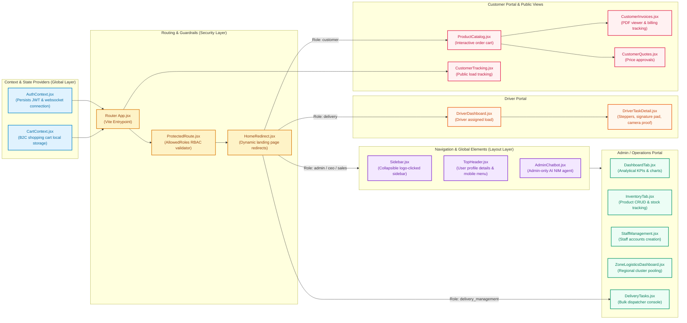
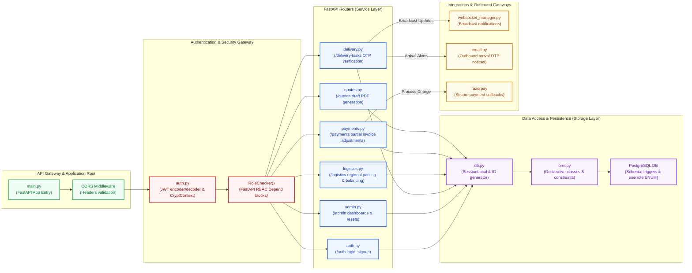

# Mermaid Diagrams Code
Below is the standalone Mermaid code for both the Frontend and Backend architecture diagrams.
---
## 1. Frontend Architecture Diagram Code (Left-to-Right)

---
## 2. Backend Architecture Diagram Code (Left-to-Right)

